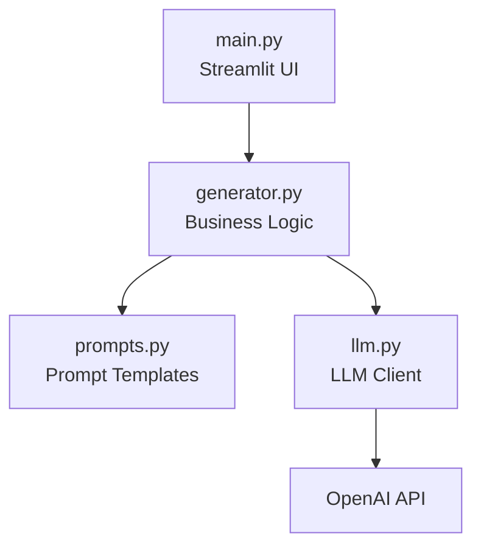

# Streamlit AI Template

[](https://github.com/Emmatshi/streamlit-ai-template/actions/workflows/ci.yml)


A reusable template for building Streamlit apps powered by OpenAI.

## Features

-   Streamlit + Poetry
-   Clean `src/` layout
-   OpenAI safety guard
-   Ready for Streamlit Cloud

## Usage

1. Click **Use this template** on GitHub
2. Clone your new repo
3. Add `OPENAI_API_KEY`:
    - Local: `.streamlit/secrets.toml`
    - Cloud: App Settings → Secrets
4. Run:

````bash
poetry install
poetry run python -m streamlit run main.py

##  Local smoke test (one last time)
```bash
rm -rf .venv
poetry env use $(pyenv which python)
poetry install
poetry run python -m streamlit run main.py
````

## 🧱 Architecture

This template follows a clean, layered architecture that separates UI, business logic, and infrastructure.



## 🚀 Use This Template

This repository is a **GitHub template**.

To create a new app from it:

1. Click **Use this template** (top right of the repo)
2. Choose a name for your new repository
3. Clone the new repo locally:
    ```bash
    git clone <your-new-repo-url>
    cd <your-new-repo>
    ```

## 🧪 Apps Built With This Template

The following applications were built using this template, validating its
architecture and reusability in real projects.

-   🧠 **Prompt Refiner**  
    A Streamlit app that rewrites rough prompts into clear, structured, and
    effective instructions for large language models.  
    🔗 Repository: https://github.com/Emmatshi/my-bc-st005  
    🌐 Live demo: https://j2tfprxajbpususshai6ds.streamlit.app/
    ```

    ```
